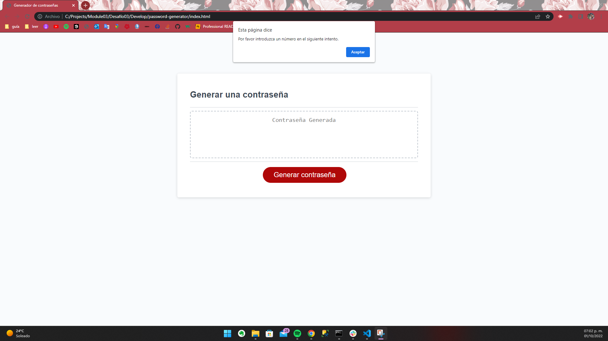

# Password Generator
## Challenge Module03  03/Oct/2022
### Último cambio: Mauricio García Hernández 01/Oct/2022

### User Story:
COMO un empleado con acceso a informacion sensible
QUIERO generar una contraseña de forma aleatoria que cumpla ciertos requisitos
PARA QUE pueda crear una contraseña fuerte que proporcione una mayor seguridad

### Criterios de aceptación:
CONSIDERANDO que necesito una nueva contraseña segura
CUANDO hago click en el botón para generar una contraseña
ENTONCES me proporcionan una serie de "prompts" con opciones para generar la contraseña
CUANDO me presentan las opciones para generar la contraseña
ENTONCES selecciono que requisitos incluir en la contraseña
CUANDO me presentan la opcion para la longitud de la contraseña
ENTONCES selecciono una longitud de al menos 8 caracteres y no mas de 128 caracteres
CUANDO me presentan las opciones sobre que tipos de caracteres incluir en la contraseña
ENTONCES confirmo si incluir o no incluir letras minúsculas o mayúsculas, numeros y/o caracteres especiales
CUANDO confirmo cada "prompt"
ENTONCES la informacion proporcionada debe ser validada y al menos un tipo de caracter debe ser seleccionado
CUANDO todos los "prompts" son respondidos
ENTONCES se genera una contraseña que cumple con los requisitos seleccionados
CUANDO se generó la contraseña
ENTONCES la constraseña se muestra en una alerta o se escribe en la página

* Repositorio: https://github.com/maugh108/password-generator
* URL: https://maugh108.github.io/password-generator/